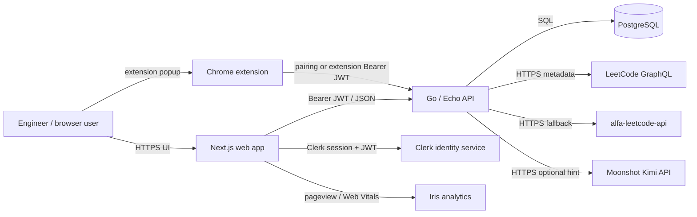
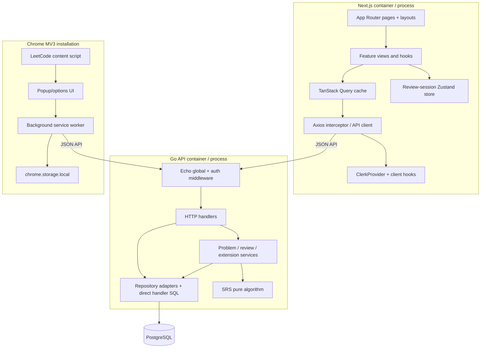
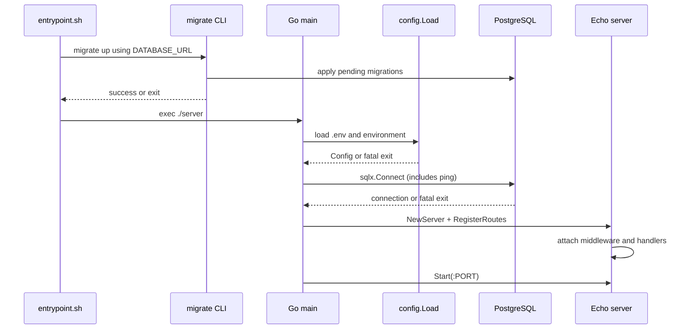

# 01 — Product, Architecture, and Repository

## 1. Executive overview

### Explain Algomind in two minutes

Algomind is a study tool for software engineers who want to retain solved
algorithm problems. A user records a LeetCode problem, associates it with an
algorithm concept, stores an explanation/solution/hint, and reviews it when the
spaced-repetition scheduler says it is due. After each review the user chooses
Again, Hard, Good, or Easy; the Go backend updates the next review date, interval,
ease factor, review history, and daily streak in one PostgreSQL transaction.

The system has three user-facing runtimes:

1. A Next.js web application provides marketing/auth pages and the authenticated
   dashboard.
2. A Go/Echo JSON API owns business operations and database access.
3. A Chrome Manifest V3 extension can quick-save the current LeetCode problem to
   an inbox; it uses its own pairing, access-token, and rotating refresh-token
   system after the web user authorizes an installation.

Clerk owns web identity. PostgreSQL owns all Algomind data. LeetCode (directly,
then through a proxy in some paths) supplies public problem metadata. Moonshot
Kimi optionally creates a short hint in a non-durable background goroutine.
Iris analytics receives web page-view and Web Vitals events. Repository evidence
says Docker images are deployed through Dokploy/Traefik on a Linux VPS, but the
actual production configuration is absent.

Evidence: `README.md`; `algomind-frontend/app/**`;
`algomind-backend/internal/server/routes.go → RegisterRoutes`;
`algomind-backend/internal/reviews/service.go → LogReview`;
`algomind-extension/src/background.ts`.

### Architecture-review explanation

Algomind is a small modular monolith with a separately built browser client.
The API is one stateless HTTP process except for two intentionally local pieces
of state: the auth middleware's known-user cache and in-memory token-bucket rate
limiters. The application is multi-user but not role-based; tenant isolation is
normally enforced by carrying the authenticated Clerk subject or extension JWT
subject into SQL predicates. The database combines conventional foreign keys
with a polymorphic `review_states`/`review_logs` model guarded by triggers.

Business logic is unevenly layered. Problem creation and review logging have
services and repository interfaces. Concept, folder, metrics, and profile
operations issue SQL directly from handlers. This is a transitional architecture,
not a consistently enforced clean/hexagonal architecture. The frontend likewise
has a useful feature-folder convention, but almost every authenticated page is a
client component and all API data is fetched after hydration through Axios and
TanStack Query.

The most important consistency boundaries are PostgreSQL transactions:

- problem row + initial review state;
- review state update + review log + user streak;
- pairing code consumption + installation + refresh token;
- refresh-token rotation/replay response;
- installation revocation + all refresh-token revocations.

The weakest reliability boundary is asynchronous hint generation: it starts a
goroutine after the problem transaction commits. There is no queue, durable job
record, retry, shutdown drain, or user-visible failed state.

### The first ten concepts to internalize

1. **Clerk subject is the web tenant key.** `users.id` is the Clerk user ID.
2. **Every new problem is reviewable immediately.** Creation inserts both
   `problems` and a due-now `review_states` row.
3. **SRS is application code, not a library.** `internal/srs/algo.go` contains
   the actual scheduling rules.
4. **Reviews are polymorphic.** A review row identifies either a `problem` or
   `concept`; triggers compensate for the lack of normal foreign keys.
5. **Concepts use copy-on-write overrides.** System concepts have `user_id NULL`;
   editing one creates a user-owned replacement linked through `base_concept_id`.
6. **The extension is a second auth client.** Pairing produces a short-lived HMAC
   JWT and a database-backed rotating opaque refresh token.
7. **The inbox is not the library.** A `problem_capture` must be converted before
   it becomes a `problem` and enters SRS.
8. **TanStack Query is the frontend server-state cache.** Zustand only holds the
   current review session cursor/queue.
9. **Deployment evidence is incomplete.** Docker behavior is confirmed; Dokploy,
   Traefik, VPS, TLS, and region are not codified.
10. **Repository security hygiene needs immediate attention.** The lockfile
    matches critical/high framework/auth advisories; see [Security](05-security-performance-debt.md).

### Main user journeys

- Create an account or sign in with email/password or Google through Clerk.
- Paste a LeetCode URL, auto-fetch metadata, add solution details, and create a
  reviewable problem.
- Open today's queue, recall the solution, reveal the answer, and rate recall.
- Browse/search/delete the personal problem library and reschedule a problem now.
- Create/edit/reset concepts, organize them into folders, and study Markdown.
- Pair the Chrome extension, quick-save a LeetCode page, then finish import in
  the web inbox.
- View due count, streak, review rate, and topic-mastery metrics.

## 2. System context and trust boundaries

Text explanation: the browser-to-web, browser/extension-to-API, API-to-database,
and API-to-third-party links are separate trust boundaries. The API trusts Clerk
only after SDK JWT verification and trusts an extension only after local JWT
verification plus a database revocation lookup. User-owned problem/answer data,
Clerk IDs, extension installation metadata, and token hashes cross into
PostgreSQL. LeetCode problem/solution text crosses to Kimi when automatic hints
are requested. Web navigation and performance information crosses to Iris.

### Process, network, deployment, and failure boundaries

| Boundary | Behavior and owner | Failure consequence |
|---|---|---|
| Next.js process | Renders public/server pages and hydrated dashboard clients | Marketing and dashboard UI unavailable; API may remain healthy |
| Go API process | Auth, validation, orchestration, all SQL and integrations | All dynamic product operations stop |
| Chrome service worker | Stores/refreshes tokens and performs captures | Extension fails independently; web still works |
| PostgreSQL | Sole durable application state | API startup fails or requests error; no degraded mode |
| Clerk | Identity/session issuance and backend JWT verification | Login/session issuance or protected API access fails |
| LeetCode/proxy | Metadata enrichment | Manual problem entry still works; capture is stored as `failed` |
| Kimi | Optional hint generation | Problem remains created, hints remain blank; no durable retry |
| Iris | Analytics only | Product flow should continue; client-library failure behavior is not tested |

There is synchronous communication everywhere except the Kimi goroutine.
There are no message brokers, webhooks, cron tasks, service-to-service calls,
object stores, or caches beyond browser/query cache and in-process maps.

## 3. Container/component architecture

Text explanation: the frontend uses server-rendered layouts/public pages but
does authenticated data work in client components. The backend's intended
dependency direction is handler → service → repository, yet several handlers
go straight to SQL. The extension deliberately keeps tokens in the background
worker's local storage; the content script sends only current-page metadata.

### Data ownership

- Clerk owns credentials, OAuth configuration, sessions, and primary identity.
- Algomind `users` owns only the Clerk ID plus review-streak counters.
- Each user owns problems, captures, folders, folder items, review rows, and
  extension installations/tokens.
- Concepts may be global (`user_id IS NULL`) or user-owned.
- LeetCode remains source of public problem metadata; Algomind stores a snapshot.
- No application facility exports, anonymizes, or deletes the Clerk identity
  automatically; deleting `users` cascades most owned rows.

## 4. Guided repository map

### Root

| Path | Meaning, dependencies, and risk |
|---|---|
| `README.md` | Product/deployment narrative. Useful orientation, but drifted: says Next.js 15 (manifest is 16), says five tables (there are eleven), says all routes require Clerk (pair/refresh and extension routes do not), and claims obsolete `LLM_*` fallbacks. Do not treat as contract. |
| `AGENTS.md` | Contributor guidance, not runtime code. It also claims no tests and existing context maps, both contradicted by the tree. |
| `algomind-concepts.MD` | Concept content marked by commit `83de8bd` as “to be ingested later.” No importer or seed reference exists; it is currently manual source material/dead-looking data. |
| `docs/agents/` | Agent workflow metadata. `domain.md` expects a missing `CONTEXT-MAP.md` and per-project context/ADR folders. |
| `.scratch/` | Local issue-tracker convention if populated; no product runtime dependency. |
| unrelated untracked scraper/template files | Present before this investigation and not part of Algomind's tracked architecture. |

### Frontend: `algomind-frontend/`

| Path | Responsibility | Depends on / consumers | Modification risk |
|---|---|---|---|
| `app/layout.tsx` | Root Clerk, Query, theme, toast, analytics providers and metadata | Every page | **High:** provider order and server/client boundary |
| `proxy.ts` | Clerk route protection for `/dashboard` and `/admin` | Next.js request routing | **Critical:** sole web-page authorization gate; dependency advisory applies |
| `app/(auth)/**` | Custom email/password, Google OAuth, email-code sign-up | Clerk client SDK | **High:** auth UX and session activation |
| `app/dashboard/layout.tsx` | Protected sidebar/header shell | All dashboard pages | Medium |
| `app/dashboard/**/page.tsx` | Route composition. Most are client-rendered; add-problem is async server wrapper | Feature views/hooks | Medium |
| `features/**/api` | Axios calls, query keys, invalidation | Feature components | **High:** duplicated implicit API contracts |
| `features/**/components` | Product interactions and much local business/UI logic | API hooks, UI primitives | High in `submitProblemForm.tsx`, `concept-manager.tsx`, `review-card.tsx` |
| `features/review/store` | In-memory current review session | Review page/card | Medium; refresh loses session cursor |
| `lib/api-client.ts` | API base URL, Clerk token injection, global 401 toast | All data hooks | **Critical:** auth and every API request |
| `components/ui` | Mostly shadcn/Radix primitives | Entire UI | Low individually; generated/upstream-like code |
| `app/globals.css`, `tailwind.config.js`, `components.json` | Theme/design-system glue | All rendered UI | Medium; history removed original design docs |
| `next.config.ts`, `Dockerfile`, lockfile | Standalone build/deployment and versions | Production artifact | **High:** supply chain and runtime behavior |
| `.next/` | Generated build output, ignored; never edit | Docker copies fresh output | None as source |

Read first: `app/layout.tsx`, `proxy.ts`, `lib/api-client.ts`,
`components/providers.tsx`, `features/add-problem/api/useCreateProblem.ts`,
`features/review/**`, and the target feature's page/hook/view.

### Backend: `algomind-backend/`

| Path | Responsibility | Architecture reality / risk |
|---|---|---|
| `cmd/api/main.go` | Only executable entry point: config → DB → server/routes → blocking start | **Critical** startup; no signal-aware shutdown |
| `internal/config/config.go` | `.env` load, defaults, required Clerk/DB checks | High; only some values validated |
| `internal/server/server.go` | Echo, global middleware, CORS, health, validator | **Critical** cross-cutting security/operations |
| `internal/server/routes.go` | Composition root and complete route registration | **Critical** API surface and dependency wiring |
| `internal/middleware/` | Clerk JWT/user provisioning and extension JWT/revocation | **Critical** trust boundary |
| `internal/handlers/` | HTTP binding/validation/status mapping; some contain raw SQL/business rules | Uneven layer; concepts/folders/metrics/profile are tightly coupled to SQL |
| `internal/problems`, `internal/reviews`, `internal/extensions` | Transactional orchestration/business logic | **Critical** consistency boundaries |
| `internal/repositories` | Interfaces plus PostgreSQL implementations | Useful seams, but interfaces and implementations share files/package |
| `internal/srs` | Pure review scheduling | **Critical domain logic**, well unit-tested |
| `internal/leetcode`, `internal/llm`, `internal/graphql` | External clients/query constant | Network and data-sharing risk |
| `internal/models`, `internal/dto` | DB/API shapes | Contracts duplicated in TypeScript |
| `internal/observability`, `server/error_handler.go` | Request IDs, structured request/error logging | Important, but mixed with `log.Printf` elsewhere |
| `internal/ratelimit` | Per-process token-bucket map | Only extension auth endpoints use it; map never evicts |
| `migrations/` | Authoritative schema history | **Critical**; automatic production startup dependency |
| `Dockerfile`, `entrypoint.sh` | Build static binary, copy migrate CLI, run migrations, start | **Critical** rollout and availability behavior |
| `docker-compose.yml`, `Makefile` | Development DB and migration shortcuts | Contains hardcoded development credentials |

Read first: `cmd/api/main.go`, `server/{server,routes}.go`,
`middleware/*.go`, `problems/service.go`, `reviews/service.go`,
`srs/algo.go`, repositories, then migrations in order.

### Extension: `algomind-extension/`

| Path | Responsibility | Risk |
|---|---|---|
| `manifest.json` | Permissions, allowed hosts, content/background entry points | **Critical** extension security/review |
| `src/background.ts` | Message router, pair/refresh/logout/capture, token lifecycle | **Critical** auth and network state |
| `src/storage.ts` | Session/settings in `chrome.storage.local` | **Critical** long-lived refresh token |
| `src/content-script.ts` | Reads LeetCode URL/title only | Low; deliberately narrow |
| `src/popup.ts` | User flow and service-worker messages | Medium |
| `src/options.ts`, `src/config.ts` | User-configurable app/API endpoints | Medium; host permissions still constrain requests |
| `scripts/build-release.js`, `PUBLISH.md` | Manual Web Store artifact and checklist | High release process; no automated CI |
| `dist/` | Generated unpacked extension output, tracked | **Do not edit manually.** It was already dirty/stale relative to source during investigation. |

### Dead-looking, duplicate, generated, or unclear code

- `components/shared/login-form.tsx` is a generic inert form and has no imports.
- `features/add-problem/components/form/schema.ts` defines an old fixed-concept
  schema and has no imports; the real form uses a local `FormFields` model.
- `features/admin/types.ts` exists, but no admin page exists under `app/admin`
  beyond a layout and no role authorization exists.
- `internal/handlers/fetch_leetcode.go` duplicates URL parsing and two external
  fetch implementations now also centralized in `internal/leetcode/client.go`.
- `@bigchill101/iris` and `iris-analytics` are both runtime dependencies, but
  only `iris-analytics` is imported.
- `@tanstack/react-form` is declared, while the application uses
  `react-hook-form`.
- `algomind-concepts.MD` has no ingestion path.
- `dist/` is generated but tracked, which creates source/artifact drift.
- `company-engineering-template/` and scraper files were untracked and explicitly
  excluded from architectural claims.

## 5. Runtime entry points and startup

### Frontend

- Development: `npm run dev` → `next dev --webpack`.
- Build: `npm run build` → `next build --webpack`.
- Direct production script: `npm run start` → `next start`.
- Container production: Node 20 Alpine builder runs `npm ci` and build;
  standalone output is copied to a Node 20 Alpine runner; `node server.js` binds
  `0.0.0.0:$PORT` with `PORT=3000`.
- Next initializes `app/layout.tsx`; Clerk/Query/theme providers become active
  in the browser. Protected route requests pass through `proxy.ts`.

Build-time public variables are embedded into browser code. No runtime
configuration validation exists. A bad `NEXT_PUBLIC_API_URL` can therefore
produce a successful image that cannot talk to the API.

### Backend startup sequence

Text explanation: in the container, migrations must succeed before the process
starts. The Go binary then validates only Clerk and database presence, connects
to PostgreSQL, constructs Echo and all services synchronously, and blocks in
`Echo.Start`. A returned server error is fatal. `defer db.Close()` runs only if
`main` unwinds; there is no `SIGTERM` handler, `Echo.Shutdown`, request drain, or
goroutine drain. Local `go run` does not automatically migrate.

### Extension entry points

Chrome loads `background.js` as a module service worker, injects
`content-script.js` on LeetCode problem pages at `document_idle`, and loads
`popup.html`/`popup.js` on action click. `options.html` edits endpoints.
The worker is event-driven and may be suspended between messages; durable state
therefore lives in `chrome.storage.local`, while `refreshInFlight` only
deduplicates refreshes within one worker lifetime.

### Absent entry points

There is no separate worker binary, scheduler, cron process, CLI, webhook
receiver, test runner for frontend/extension, or infrastructure deployment
script. The Kimi goroutine is launched only from problem creation and dies with
the API process.

