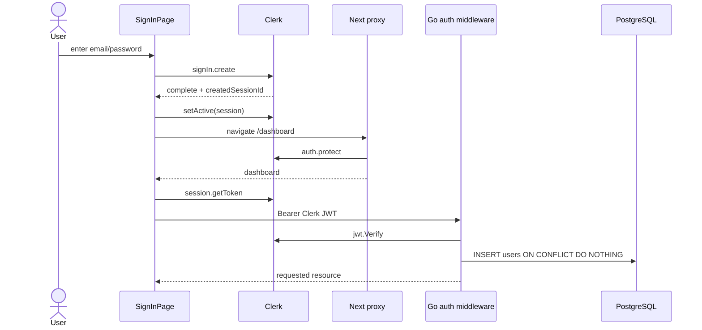
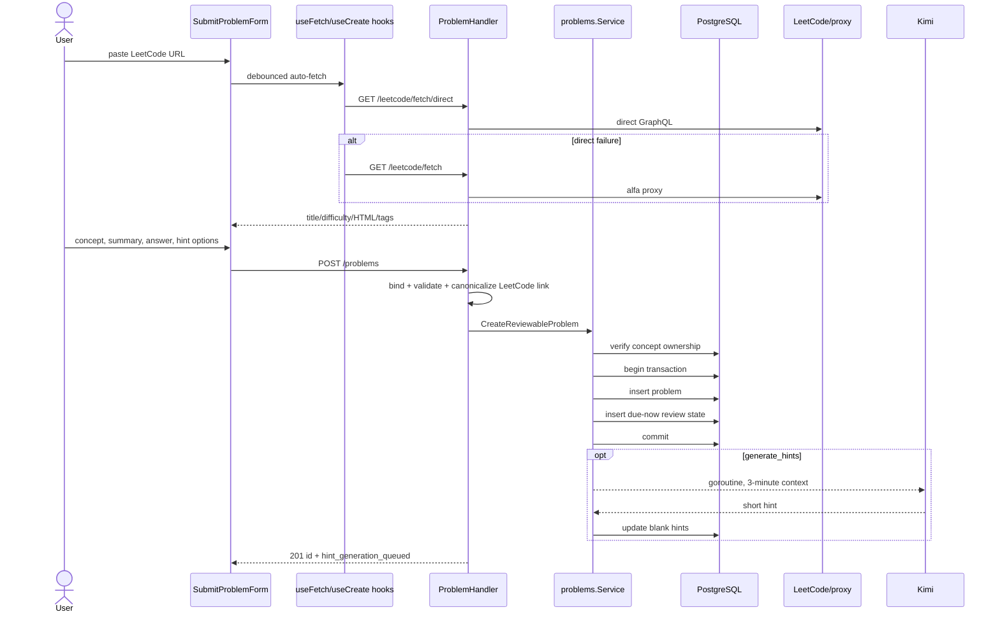
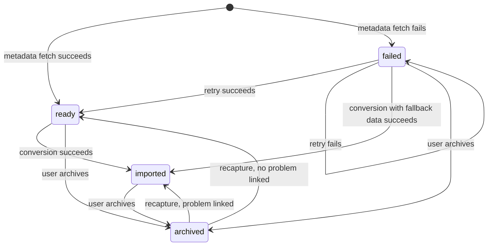

# 02 — Runtime Journeys, Frontend, Backend, and Domain

## 1. Web registration and login

### Email/password sign-in



Text explanation: the custom client page calls Clerk directly. Once a session is
active, Next's `proxy.ts` protects dashboard navigation. Dynamic data is a
separate boundary: the Axios interceptor reads `window.Clerk.session`, asks Clerk
for a current token, and sends it to Go. The Go Clerk SDK verifies it and lazily
provisions `users.id`; an in-memory `sync.Map` skips repeat provisioning in that
API process.

Evidence: `app/(auth)/sign-in/.../page.tsx → handleSubmit`;
`proxy.ts`; `lib/api-client.ts`; `internal/middleware/auth.go`.

### Google OAuth and sign-up

- Google sign-in calls `signIn.authenticateWithRedirect`, returns through
  `/sso-callback`, and Clerk's `AuthenticateWithRedirectCallback` completes the
  flow.
- Email sign-up calls `signUp.create`, prepares `email_code` verification, then
  `attemptEmailAddressVerification`; completed sessions are activated and routed
  to `/dashboard`.
- The repository does not implement password reset despite an unused generic
  login form containing a “Forgot password?” link.
- Logout is initiated in the dashboard header through Clerk; the Go API holds no
  web refresh/session tokens to revoke.
- **Unknown:** enabled Clerk providers, password policy, JWT template, session
  lifetime, cookie settings, MFA, bot protection, webhook configuration, and
  Clerk production instance settings are dashboard-owned and absent.

### Failure paths

- Clerk errors are displayed from `err.errors[0].longMessage`.
- `proxy.ts` rejects unauthenticated protected navigation.
- Missing API header returns an older `{error: ...}` shape without request ID;
  invalid JWT does the same. Other errors normally use `{message, request_id}`.
- If PostgreSQL user provisioning fails, the request returns 500.
- A valid Clerk user is not provisioned until the first API request. `GET
  /profile` redundantly ensures the user again.

## 2. Add a problem manually or from LeetCode



Text explanation: the form uses React Hook Form with its own `FormFields` type,
not the orphaned Zod schema. A LeetCode URL triggers client-side cleaning and two
legacy API attempts. On submit, the client heuristically wraps code-like answers
in a Markdown code fence and uppercases difficulty. The backend validates
required fields, recognizes/canonicalizes LeetCode links, checks whether the
selected concept is global or belongs to the same user, and creates the problem
and SRS state atomically.

The database unique partial index makes LeetCode identity
`(user_id, external_source, external_problem_key)` idempotent. A duplicate
manual LeetCode addition returns 409 with the existing ID. Non-LeetCode manual
problems have no deduplication/idempotency key and repeated submissions create
duplicates.

Evidence: `submitProblemForm.tsx`; `useFetchLeetCode.ts`;
`useCreateProblem.ts`; `handlers/problem.go → CreateProblem`;
`problems/service.go → CreateReviewableProblem`;
`repositories/problem.go`; migration `000010`.

### Validation and contract duplication

| Rule | Frontend | Backend | Database |
|---|---|---|---|
| concept required | form selection/type | `required` int64; service accessibility | FK to `concepts` |
| difficulty | UI choices/uppercase | `oneof=EASY MEDIUM HARD` | check constraint |
| title/summary/answer | required UI | `validate:"required"` | NOT NULL + nonblank checks (added `NOT VALID`) |
| description | optional UI/API | optional | nullable |
| LeetCode URL | client regex/cleaning | two different parsers, both use broad host containment | canonical snapshot only |
| answer formatting | client heuristic | no Markdown validation | plain text |

The database `NOT VALID` checks enforce new writes even though old rows may remain
unvalidated. There is no request-body size limit, string-length limit, HTML
sanitization, or URL length limit.

### Error and side-effect paths

- Invalid JSON/validation: 400.
- Invalid concept: 400; another user's concept: 403.
- External duplicate: 409.
- DB failures roll back both inserts.
- Kimi disabled/failure: problem remains created with blank hints; queue flag is
  false when disabled, true once the goroutine is merely accepted. Later failure
  is only in logs.
- A process restart after commit can lose an accepted hint job.
- TanStack Query invalidates review queue, metrics, library, and captures after
  success. The client does not poll for the asynchronously generated hint.

## 3. Complete a review

```mermaid
sequenceDiagram
    actor U as User
    participant UI as ReviewPage/Card
    participant Z as Zustand
    participant API as ReviewHandler/Service
    participant SRS as CalculateReview
    participant DB as PostgreSQL

    UI->>API: GET /reviews/queue
    API->>DB: due rows, order oldest, limit 50
    DB-->>UI: queue
    UI->>Z: initSession(queue)
    U->>UI: reveal; rate 1..4
    UI->>API: POST /reviews/problem/:id/log
    API->>DB: read current state
    API->>SRS: rating + interval/ease/streak/difficulty
    SRS-->>API: next date + new state
    API->>DB: begin transaction
    API->>DB: update state
    API->>DB: insert log
    opt problem rated AGAIN
        API->>DB: reset parent concept state
    end
    API->>DB: update user daily streak
    API->>DB: commit
    API-->>UI: next_review
    UI->>Z: nextCard
```

The queue query can theoretically return problem or concept rows and the backend
route accepts either entity type. Current frontend types assume problem fields,
and `useReviewLog` hardcodes `/reviews/problem/...`. Therefore concept-review
support exists in schema/backend but is not a working frontend journey.

### SRS rules

`internal/srs/algo.go → CalculateReview` is a modified SM-2-like algorithm:

- Ease begins at 2.5 and is clamped to `[1.3, 3.0]`.
- “Learning” means `streak < 2`; the `currentInterval` argument is ignored by
  `isLearningStage`.
- Again resets streak and schedules today (`interval=0`); after learning it also
  reduces ease by 0.20.
- Hard in learning schedules 1 then 3 days; in mature state multiplies interval
  by 1.2 and reduces ease by 0.15.
- Good in learning schedules difficulty-adjusted 1 then 6 days; mature state
  multiplies by current ease and difficulty multiplier.
- Easy raises ease by 0.15; learning schedules difficulty-adjusted 3 then 8 days;
  mature state uses ease × 1.3 × difficulty multiplier.
- Difficulty multiplier: Easy 1.15, Medium/default 1.0, Hard 0.75.
- Scaled intervals use `ceil` and a minimum of one day.

UI button subtitles (`<10m`, `2d`, `4d`, `7d`) are static and often do not match
the calculated interval. “Again” is actually due immediately, not in ten minutes.

### Transaction and failure semantics

Review state, log, and user streak are atomic. The parent-concept reset is
explicitly non-fatal and its error is swallowed without logging, so a committed
problem failure may leave its concept schedule unchanged. Concurrent double
submissions are not serialized: both requests can read the same state and each
insert a log; last update wins. There is no idempotency key or row lock.

The queue is capped at 50 and has no pagination. The Zustand session is a snapshot;
query invalidation does not rebase the current local queue. Refreshing the page
fetches again.

## 4. Chrome extension pairing, capture, and conversion

### Pairing and tokens

```mermaid
sequenceDiagram
    actor U as Signed-in user
    participant Web as ExtensionManagementView
    participant API as Extension service
    participant DB as PostgreSQL
    participant Ext as Chrome background worker

    U->>Web: Create pairing code
    Web->>API: POST /extension/pairing-codes + Clerk JWT
    API->>DB: expire other active codes; store hash + TTL
    API-->>Web: 8-char code once
    U->>Ext: enter code
    Ext->>API: POST /extension/auth/pair
    API->>DB: SELECT code FOR UPDATE
    API->>DB: installation + hashed refresh token + mark code used
    API-->>Ext: HMAC JWT + opaque refresh token
    Ext->>Ext: chrome.storage.local
```

The code uses an ambiguity-reduced 32-character alphabet and eight random bytes,
rendered `XXXX-XXXX`. Only its SHA-256 hash is stored. Creating a new code marks
all prior unexpired codes used. Pairing is transactional and row-locked.

Access tokens are HS256 JWTs with issuer `algomind-backend`, audience
`algomind-extension`, Clerk user ID subject, installation ID, `iat`, `nbf`, and
expiry (default 15 minutes). Middleware verifies signature/registered claims and
audience, checks installation revocation in the DB, updates `last_seen_at`, and
sets both IDs in Echo context.

Refresh tokens are 32 random bytes, stored only as SHA-256 hashes, defaulting to
30 days. Every refresh transaction row-locks the token, creates a replacement,
revokes/links the old token, and updates heartbeat. Reuse of a replaced/revoked
token revokes the whole installation. The extension deduplicates simultaneous
refresh calls in one worker with `refreshInFlight`.

### Quick-save capture

1. Popup asks the content script for the current LeetCode URL/title.
2. Background worker obtains/refeshes an access token.
3. `POST /extension/captures` normalizes URL to a canonical LeetCode slug.
4. API first checks an already imported problem, then an existing capture.
5. New capture synchronously tries direct LeetCode GraphQL and then the proxy.
6. Successful metadata is stored as `ready`; provider failure is stored as
   `failed` with fallback title and error details.
7. The popup opens either the existing library item or the inbox.

The operation is idempotent per user/source/slug through unique indexes. Archived
captures are reactivated. The API returns 200 even for newly created captures.

### Finish import

The inbox links to `/dashboard/add-problem?captureId=...`. The server page passes
the numeric ID to the client form, which loads captured data. Submission changes
the endpoint to `/problem-captures/:id/convert`; conversion verifies capture
ownership, invokes the same problem creation service, and marks the capture
imported. These are **not one transaction**: if the problem commit succeeds and
`MarkImported` fails, the capture looks unfinished until a retry detects the
duplicate and repairs the link.

### Capture lifecycle



Text explanation: `pending_enrichment` is accepted by the database/UI type but no
current code writes it. Archive is a state update, not deletion. Conversion
creates a durable `problems` row; deleting that problem sets capture `problem_id`
to null but leaves `capture_state='imported'`, creating a possible inconsistent
state.

## 5. Concepts and folders

### Concept model

- A system concept has `user_id=NULL`, unique system title.
- A user-created concept has a user ID and no base.
- Editing a system concept creates a user override whose `base_concept_id`
  points at the system row. Listing suppresses the base when an override exists.
- Editing a user-owned concept updates it.
- Reset deletes the user's override and reveals the base again.
- Deleting only permits a user-owned concept.

This copy-on-write model preserves shared defaults but has a major referential
semantic: existing problems still point to whichever concept ID they were
created with. Creating an override does not repoint them. Deleting a user
concept cascades and deletes all problems linked to it because `problems.concept_id
ON DELETE CASCADE`, which is a high-impact behavior not signaled in handler code.

### Folders

Folders may nest through `parent_folder_id`; deleting a parent cascades children.
A concept may occur in at most one folder per user. The UI supports filtering,
creating/editing/studying concepts, and assignment with drag/drop-related
dependencies.

Folder handlers validate that the record being updated/deleted belongs to the
user, but create/update/assignment do not validate that the referenced parent,
folder, or concept is accessible to that same user. This is covered as a
tenant-integrity finding in [05](05-security-performance-debt.md).

## 6. Library and dashboard

### Library

`GET /problems` selects only list fields and has no ordering, search, pagination,
or server filtering; the frontend filters in memory. Detail fetch is scoped by
user. Delete is scoped by user but returns success even when no row existed.
“Review” upserts a due-now state and resets interval/ease, but not `streak`; this
can create a logically mixed state.

Problem descriptions are stored as HTML and rendered with
`dangerouslySetInnerHTML` in form preview, review cards, and detail view.
Solutions are stored as Markdown and rendered by `react-markdown`.

### Dashboard metrics

- Dashboard summary uses scalar subqueries for due count, streaks, today's
  reviews, and total problems.
- Recall groups review logs by date for 1–90 days; Good/Easy count as successful.
  Missing dates are omitted rather than zero-filled.
- Topic mastery combines retention (50%), normalized ease (30%), and a 30-day
  normalized interval (20%). The displayed `problem_count` is implemented as
  `COUNT(DISTINCT ps.concept_id)`, so it is 0 or 1, not the number of problems.
- Most-used language groups problem answers and returns one top value; ties have
  no deterministic order.

These are product formulas, not objective cognitive-science measurements. They
should be treated as application-defined metrics.

## 7. Frontend architecture

### Rendering and routing

Public marketing/resource pages are server components and statically generated.
Auth routes are dynamic client pages. Most dashboard pages declare `use client`,
so protected HTML routes are server-gated by Clerk but product data arrives after
hydration. The async add-problem wrapper and dynamic problem route are
server-rendered shells around client views.

There are no Next Route Handlers, Server Actions, middleware API proxy, explicit
error boundaries (`error.tsx`), loading boundaries (`loading.tsx`), or not-found
files. Loading/error states are implemented ad hoc in components; some hooks
do not render errors.

### State and data

- TanStack Query owns remote server state. Defaults: 1-minute stale, 5-minute GC,
  one retry, no focus refetch.
- Concepts/folders override to 10-minute stale and 30-minute GC.
- Query keys form the implicit cache contract. Prefix invalidation of `['metrics']`
  correctly covers dashboard/recall/mastery.
- `useAuthQuery` blocks reads until Clerk loads/signs in. Mutations are not
  similarly gated but exist only on protected pages.
- Axios adds Clerk bearer tokens only in the browser. The API abstraction is
  therefore not server-safe for authenticated calls.
- Zustand owns queue snapshot, current index, and completion only. It has no
  persistence.
- Sidebar openness uses a non-HttpOnly browser cookie; theme state is delegated
  to `next-themes`; extension tokens use Chrome local storage.

### Forms and validation

The active problem form uses React Hook Form with manual rules and server
validation. Concept editing uses component-local state and backend validation.
The orphaned Zod file means the README/agent claim “Zod for runtime validation”
is not representative of the central form.

### Styling, accessibility, performance

Tailwind v4, CSS variables, shadcn/Radix, Lucide/Tabler icons, Recharts, and
Markdown comprise the design layer. Radix primitives provide a useful
accessibility baseline. Forms use labels and loading/disabled states. Review
keyboard shortcuts help efficiency, but there is no visible shortcut
instruction for all users, no automated accessibility test, and four-column
rating buttons may be cramped on narrow screens.

Performance strengths: static public pages, standalone build, package-import
optimization, query caching, gzip API middleware. Risks: most dashboard code
ships to the browser; `submitProblemForm.tsx` and large shadcn sidebar are large;
charts and two icon libraries add bundle weight; no bundle budget or measured
report is committed. The analyzer is available through `ANALYZE=true`.

### Analytics

`AnalyticsComponent` starts Iris at `https://analytics.algomind.pro` with site
ID `algomind`, pageviews, Web Vitals, and batch size five. `usePathname` is read
but unused. There is no consent flow, privacy documentation in the repository,
user ID attachment, event schema, retention configuration, or failure test.

## 8. Backend architecture

### Actual layers

| Capability | Handler | Service | Repository | Domain |
|---|---|---|---|---|
| problems | thin-ish | yes | interfaces/adapters | concept access, duplicate, create + hint |
| reviews | thin | yes | interfaces/adapters | SRS package |
| extension auth | thin | yes | raw SQL inside service | token lifecycle |
| captures | orchestration-heavy | problem service only | capture adapter | lifecycle partly in handler |
| concepts/folders | SQL + business rules | no | no | handler |
| metrics/profile | SQL | no | no | handler/query |

This is a partial repository/service refactor. Git commits `a1cae9e` through
`6c4d88b` explicitly extracted repositories on 2026-05-01.

### Middleware order

Echo global middleware is registered RequestID → Recover → Gzip →
RequestLogger → CORS in source order. Echo executes middleware in reverse
registration wrapping order; exact before/after timing should be confirmed
against Echo when modifying ordering. Route-group auth then runs for the matched
group. `/health`, pair, and refresh are unauthenticated; `/extension/**` uses
extension auth; the remaining `/api/v1/**` routes use Clerk auth.

### Error mapping and logging

A central error handler emits `{message, request_id}` and logs status/internal
error. Request logger emits structured zerolog fields. Many handlers also use the
standard logger, producing mixed formats and duplicate events. Auth middleware
returns JSON directly, bypassing the central shape. There are no typed domain
error envelopes or stable error codes except capture database fields.

### Transactions, concurrency, idempotency, resilience

Transaction boundaries are listed in [01](01-architecture-and-repository.md).
SQL uses parameters, reducing injection risk. There are no explicit isolation
levels, retry-on-serialization logic, distributed locks, circuit breakers, or
general HTTP rate limits. LeetCode and Kimi have timeouts; the legacy proxy
handler uses package-level `http.Get` with no explicit timeout. Database pool
uses library defaults and has no max/open/idle/lifetime settings.

No graceful shutdown exists. In-process caches/rate limits reset on restart and
do not coordinate across replicas, which matters if the API scales horizontally.

## 9. Domain glossary and invariants

| Term | Meaning and invariant | Lifecycle owner |
|---|---|---|
| User | Clerk subject plus streak counters; ID is text PK | Auth middleware/profile |
| System concept | Shared theory row, `user_id NULL` | Seed/manual DB; no admin API distinction |
| Concept override | User replacement of one system concept; unique per user/base | Concept handler |
| User concept | Private concept, no base required | Concept handler |
| Folder | User-owned optional hierarchy | Folder handler |
| Problem | User-owned reviewable algorithm item tied to exactly one concept | Problem service |
| External identity | Optional source/key unique per user | Problem service/index |
| Review state | Current schedule for a user/entity tuple | Problem/review services |
| Review log | Immutable-looking rating event; no update/delete API | Review service |
| Rating | AGAIN, HARD, GOOD, EASY | UI/API/DB |
| Capture | Inbox snapshot keyed per user/source/problem | Capture handler/repository |
| Pairing code | One-use short authorization grant | Extension service |
| Installation | Revocable browser identity | Extension service |
| Refresh token | One-use rotating opaque credential, hash at rest | Extension service |
| Access token | Short-lived signed extension JWT | Extension service/middleware |
| Hint job | Ephemeral goroutine, not a durable domain entity | Problem service |

### Review-state invariants

- Unique `(user_id, entity_type, entity_id)`.
- Entity type is concept/problem.
- Problem references must exist and belong to the same user; concept references
  need only exist.
- Interval/streak nonnegative; ease 1.3–3.0.
- Problem/concept deletion triggers remove matching polymorphic review rows.
- These reference/number constraints were added `NOT VALID`, so legacy violations
  for numeric/text checks may remain unless separately validated.

### Invalid states still possible

- Folder item user ID can disagree with the referenced folder/concept owner.
- Folder parent can belong to another user or form a cycle.
- A concept override can have a title that collides with another user-created
  concept; uniqueness covers user/base, not user/title.
- Imported capture can point to null after problem deletion while state remains
  imported.
- `review_states` concept belongs to any user because concepts can be global or
  private and the trigger checks existence, not accessibility.
- A manual “add to review” can target another user's problem ID; the DB trigger
  rejects the insert, but an existing user/entity tuple conflict path and error
  semantics are not explicitly tested.
- “Add to review” resets interval/ease but leaves streak.
- Concurrent review submissions can create duplicate logs and lost schedule
  updates.

