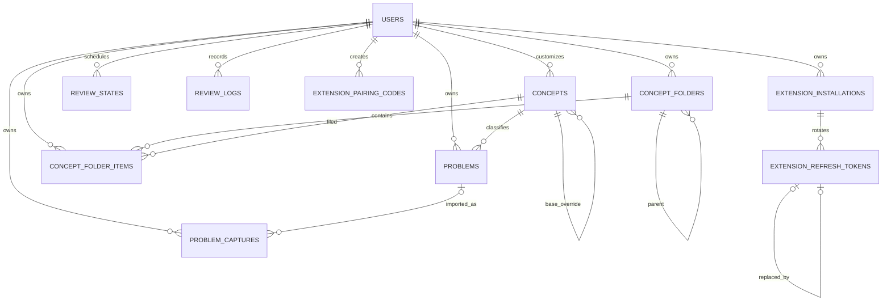

# 03 — Database, API Contracts, Authentication, and Configuration

## 1. Database and data architecture

### Technology and connection

PostgreSQL 15 is the documented/development image version
(`docker-compose.yml`). The Go process uses pgx/v5 through its `database/sql`
adapter and sqlx. `sqlx.Connect` opens and pings at startup. Pool limits,
connection lifetime, statement timeouts, transaction timeouts, role privileges,
TLS requirements, and isolation are not configured in code.

Migrations are sequential SQL files consumed by golang-migrate. The container
entrypoint runs all pending up migrations before every API start. There is no
seed command, schema checksum in CI, migration lock strategy beyond
golang-migrate/PostgreSQL behavior, pre-deploy compatibility phase, or automated
down-migration test.

### Entity-relationship model

Text explanation: normal foreign keys model user ownership, problem classification,
folders, captures, and extension credentials. Review rows are intentionally
polymorphic and cannot have a normal foreign key from one `entity_id` to two
tables; triggers validate and clean them. Concept overrides and folder hierarchy
are self-references.

### Table catalogue

#### `users`

| Column | Type/constraint | Meaning |
|---|---|---|
| `id` | text PK | Clerk subject |
| `created_at` | timestamptz, now | Local first-seen time |
| `current_streak` | int ≥0, default 0 | Consecutive review days |
| `longest_streak` | int ≥ current, default 0 | Historical max |
| `last_review_date` | date nullable | DB-local calendar day last reviewed |

Written by auth/profile and review transactions; read by auth, profile, dashboard.
Hard deletion cascades all user-owned rows. No email/name/role is stored.

#### `concepts`

`id bigserial` PK; `title`/`content` required and nonblank; optional description,
user owner, base concept, creation time. System titles are uniquely indexed where
owner is null. `(user_id, base_concept_id)` is unique for overrides. `user_id`
cascades; deleting a base sets override base to null. Problems referencing any
deleted concept cascade-delete, while folder items and review cleanup also
cascade/trigger.

Read/written by concept UI, problem validation, metrics, folders, review joins.
There is no `updated_at`, version, author, or audit trail.

#### `concept_folders`

User-owned name, optional parent, sort order, creation time. Unique
`(user_id,parent_folder_id,name)` does not prevent duplicate root names in
PostgreSQL because NULLs are distinct. Parent deletion cascades. No cycle check
or same-owner composite FK exists.

#### `concept_folder_items`

User, folder, concept, sort order. Unique `(user_id,concept_id)` enforces one
folder per concept per user. FKs are independent and do not enforce matching
owners. Indexed by folder only.

#### `problems`

User and concept FKs; title, optional link, difficulty check, required summary,
optional HTML description, required Markdown/plain answer, optional language and
hints, optional external source/key, creation time. Partial unique index on
`(user_id,external_source,external_problem_key)` when both are present; indexes
on user and concept.

Created by the problem service and read by library/review/metrics. Hints may be
updated asynchronously only while blank. Deletion is hard; it triggers review
cleanup and sets capture problem references null.

#### `review_states`

Current schedule fields plus unique user/entity tuple. Index `(user_id,
next_review_at)` supports due queue/count. Trigger validates the polymorphic
target; deletion triggers on problem/concept clean rows. It has no `updated_at`
or last-rating field.

#### `review_logs`

Append-only by API convention, with user/entity/rating/reviewed time. Indexes
support user/time and user/entity. Trigger validates entity on insert/update.
Problem/concept deletion destroys history, so it is not an immutable audit log
in retention terms.

#### `problem_captures`

User/source/slug identity, canonical URL, optional fetched title/difficulty/HTML,
JSONB tag array and raw source payload, fallback fields, state, optional problem,
error fields, capture/update/import timestamps. Unique user/source/key; index by
user/state/time. Archive is soft state; no retention cleanup. `updated_at` is
maintained by repository SQL, not a trigger.

`fallback_notes` and `source_payload` are stored but omitted from model/list/detail
responses. They are currently write-only from an application perspective.

#### Extension credential tables

- `extension_pairing_codes`: random text ID, user, unique code hash, expiry,
  used time, creation, optional device name. No cleanup.
- `extension_installations`: random text ID, user, name/browser/version, created,
  heartbeat, revoke time. Indexed for active installations.
- `extension_refresh_tokens`: random text ID, installation, unique token hash,
  expiry/use/revoke/create, self-reference to replacement. Indexed for active
  installation tokens. Token plaintext is never stored.

### Schema evolution and what it reveals

| Migration | Change | Architectural signal |
|---|---|---|
| `000001` | users, global concepts, problems, polymorphic SRS/logs, two indexes | Initial minimal study core; polymorphism chosen early |
| `000002` | add HARD rating | Product feedback expanded review vocabulary |
| `000003` | user streak counters | Dashboard engagement metric denormalized onto user |
| `000004` | problem/entity indexes | Performance tuning after list/metrics usage |
| `000005` | require description, make summary optional | Attempted product-model change |
| `000006` | reverse `000005` | Rapid rollback; summary remains core |
| `000007` | answer language | Better code rendering |
| `000008` | cleanup, checks, polymorphic validation/cleanup triggers | Explicit hardening after integrity gaps; PR #3 confirms intent |
| `000009` | custom concepts, overrides, folders | Global taxonomy evolved into per-user customization |
| `000010` | external identity, captures, extension auth tables | Browser extension became a first-class client and inbox |

Historical dates follow commit dates: core backend 2025-12; dashboard/indexes
2026-01/02; integrity 2026-02-28; custom concepts 2026-03-01; extension
2026-05-01.

### Query and integrity assessment

- No classic application N+1 was found in current list/queue/metrics paths.
  Concept folders deliberately use two queries.
- `GET /problems` lacks `ORDER BY`, pagination, and a limit.
- Review queue uses the due index and caps 50.
- Dashboard scalar subqueries each use user/time indexes; acceptable at present.
- Topic mastery uses multiple joins/aggregates and is the likeliest query to
  become CPU-heavy as logs grow.
- Capture status and external duplicate queries are indexed.
- Rate-limit store and auth user cache are in memory, not PostgreSQL.
- No soft deletion for problems/concepts/users; deleting concepts may erase
  problems and review history.
- No audit table, change history, optimistic concurrency, or row version.
- No retention/archival policy exists for logs, captures, pairing codes, or
  refresh tokens.
- Backups, replicas, vacuum/analysis, restore drills, DB monitoring, encryption,
  and least-privilege role policy are **Unknown**.

## 2. API conventions

Base path is `/api/v1`; health is `/health`. JSON is the intended representation.
All normal app routes require `Authorization: Bearer <Clerk JWT>`. Extension
routes use the extension JWT except pair/refresh. There is no OpenAPI schema,
generated client, version negotiation, ETag, cursor, idempotency header, or
contract test.

Success responses are endpoint-specific. Central errors are
`{"message": string, "request_id": string}`. Auth middleware instead emits
`{"error": string}` and extension auth emits `{"message": string}`. Validation
messages expose validator field/tag strings. No stable machine-readable error
code is guaranteed.

### Public and extension-auth routes

| Method/path | Auth | Request → success | Failures / side effects |
|---|---|---|---|
| `GET /health` | none | none → `200 {"status":"OK"}` | Does not test DB/providers; liveness only |
| `POST /api/v1/extension/auth/pair` | pairing code | code required; optional installation/browser/version → `200 Session` | 400 invalid/expired/used, 429 per-IP, 500; consumes code and creates installation/token |
| `POST /api/v1/extension/auth/refresh` | opaque refresh token in body | required token → `200 Session` | 401 invalid/expired/revoked/replay, 429 per-IP; rotates token, replay revokes installation |
| `POST /api/v1/extension/auth/logout` | extension JWT | none → `204` | revokes installation/all refresh tokens |
| `POST /api/v1/extension/captures` | extension JWT | `{url, fallback_*}` → `200 captureSaveResponse` | 400 URL, 500; fetches provider and inserts/reactivates capture |
| `GET /api/v1/extension/captures/by-external-key/:source/:key` | extension JWT | none → `200` status response | 500; read-only except middleware heartbeat |

Extension JWT middleware performs a database active-installation check and
heartbeat on every authenticated request. Pair limit is nominally 10/minute/IP
with burst 3; refresh 30/minute/IP burst 5; pairing-code creation 3/minute/user
burst 1. Because limiter instances are per process and keys never expire, limits
reset on restart, multiply with replicas, and retain unbounded IP/user entries.

### Extension management (Clerk JWT)

| Method/path | Request | Success | Authorization / side effects |
|---|---|---|---|
| `POST /extension/pairing-codes` | none | `201 PairingCode` | current user; 429 at 3/minute/user burst 1; stores a short-lived one-use code |
| `GET /extension/installations` | none | `200 Installation[]` | lists only current user's installations |
| `DELETE /extension/installations/:installation_id` | none | `204` | user-scoped revoke; 404 missing/foreign; invalidates access through the per-request installation check |

### Profile, concepts, and folders (Clerk JWT)

| Method/path | Request | Success | Authorization / errors |
|---|---|---|---|
| `GET /profile` | none | `200 {user_id}` | current user only; redundantly provisions |
| `GET /concepts` | none | visible system concepts plus user's overrides/custom rows | user-scoped list |
| `POST /concepts` | title/content required, description optional | `201 Concept` | creates private concept; duplicate/DB errors become 500 |
| `PUT /concepts/:id` | same | `200 Concept` | global → creates/updates own override; own → update; other user → 403 |
| `DELETE /concepts/:id` | none | `200 message` | only own concept; 404 otherwise; may cascade-delete problems |
| `POST /concepts/:id/reset` | none | `200 message` | deletes own override for base ID; 404 no override |
| `GET /concept-folders` | none | `{folders,items}` | current user's rows |
| `POST /concept-folders` | name required, optional parent | `201 Folder` | parent ownership not checked |
| `PUT /concept-folders/:id` | same | `200 Folder` | target own folder, but parent ownership not checked; no-row maps 500 |
| `DELETE /concept-folders/:id` | none | `200 message` | own target; cascades subtree/items |
| `PUT /concept-folder-items` | concept/folder IDs required | `200 message` | referenced ownership/access not checked |
| `DELETE /concept-folder-items/:concept_id` | none | `200 message` | deletes matching current-user item; success even absent |

### Problems and captures (Clerk JWT)

| Method/path | Request | Success | Notes |
|---|---|---|---|
| `POST /problems` | `concept_id,title,difficulty,summary,answer`; optional link/description/language/hints/generate | `201 {id,hint_generation_queued}` | 409 duplicate external; creates due state atomically |
| `GET /problems` | none | `200 ProblemList[]` | no limit/order; current user |
| `GET /problems/:problem_id` | none | `200 ProblemDetail` | 404 missing/other tenant |
| `DELETE /problems/:problem_id` | none | `200 {id}` | success even nonexistent; hard delete |
| `POST /problems/add-to-review-queue/:problem_id` | none | `200 {id}` | upserts due state; invalid/foreign ID surfaces as 500 |
| `GET /problem-captures` | none | non-archived captures | ordered newest |
| `GET /problem-captures/:capture_id` | none | capture | 404 missing/other tenant |
| `POST /problem-captures/:id/retry-enrichment` | none | refreshed capture | synchronous provider call |
| `POST /problem-captures/:id/archive` | none | `204` | soft state |
| `POST /problem-captures/:id/convert` | problem fields excluding link | 201 new or 200 already imported | verifies capture/concept ownership; two-step problem/capture consistency |

Problem list response fields are `id,title,difficulty,tag,date_added`; detail adds
`description,answer,answer_language,hints`. It omits link, summary (despite model),
concept ID, and external identity. `tag` comes from the referenced concept title.

### Reviews, metadata, and metrics (Clerk JWT)

| Method/path | Inputs | Success | Notes |
|---|---|---|---|
| `GET /reviews/queue` | none | up to 50 due `ReviewQueueItem`s | union-like nullable problem/concept fields |
| `POST /reviews/:entity_type/:entity_id/log` | rating enum | `200 {message,next_review}` | transaction; no entity-type route validation/idempotency |
| `GET /leetcode/fetch` | `?url=` | normalized metadata | alfa proxy; no explicit client timeout |
| `GET /leetcode/fetch/direct` | `?url=` | normalized metadata | direct GraphQL; 10-second client |
| `GET /metrics/dashboard` | none | due/streak/reviews/total | DB timezone affects “today” |
| `GET /metrics/recall` | optional `days` 1–90; invalid defaults 7 | daily data points | Good/Easy successes |
| `GET /metrics/mastery` | none | concept mastery array | `problem_count` calculation bug |
| `GET /metrics/most-used-language` | none | `{language: string|null}` | tie nondeterministic |

### Calling-client map

This map connects HTTP contracts to their known callers. “No in-repository
caller” means the route is registered and may be used manually or externally;
it does not prove the route is dead.

| Route group | Calling code |
|---|---|
| `/profile` | no in-repository caller found; authentication middleware provisions users independently |
| `/concepts*` | `features/edit-concepts/api/useConcepts.ts` |
| `/concept-folders*`, `/concept-folder-items*` | `features/edit-concepts/api/useConceptFolders.ts` |
| `/problems` create | `features/add-problem/api/useCreateProblem.ts`; capture conversion reuses this hook with another path |
| `/problems` list/detail/delete/queue | `features/library/api/useGetProblems.ts`, `useGetProblemById.ts`, `useDeleteProblem.ts`, `useAddProblemToReviewQueue.ts` |
| `/problem-captures*` | `features/problem-captures/api/useProblemCaptures.ts`; conversion from `features/add-problem/api/useCreateProblem.ts` |
| `/reviews/queue`, `/reviews/.../log` | `features/review/api/useReviewProblems.ts`, `useReviewLog.ts` |
| `/leetcode/fetch*` | `features/add-problem/api/useFetchLeetCode.ts` tries direct, then fallback |
| `/metrics/dashboard`, `/recall`, `/mastery` | corresponding hooks under `features/dashboard/api` |
| `/metrics/most-used-language` | `features/add-problem/api/useGetMostUsedLanguage.ts` |
| Clerk-authenticated `/extension/pairing-codes` and `/installations*` | `features/extension/api/useExtensionManagement.ts` |
| `/extension/auth/pair`, `/refresh`, `/logout`, `/extension/captures` | `algomind-extension/src/background.ts` |
| `/extension/captures/by-external-key/...` | no in-repository caller found |
| `/health` | Docker health checks and manual/operator probing; no application caller |

### Internal/event/file contracts

- Frontend types manually mirror JSON DTOs; there is no shared package or schema
  generation.
- Extension `PairResponse` manually mirrors Go `Session`.
- Chrome runtime messages in `background.ts` are a discriminated union but popup
  calls use `unknown`; the content-script message is not in that union.
- The only asynchronous “message” is an in-memory Go function closure for hints.
- The extension release contract is a ZIP of `dist/` with localhost host
  permission removed.
- Source payload is opaque JSONB; no schema/version field exists.
- No webhooks, queue messages, cron inputs, upload/file formats, or internal RPC
  contracts exist.

## 3. Authentication and authorization

### Web identity

Clerk's Next.js SDK protects pages and creates/activates sessions. The browser
retrieves a session token; Go's Clerk SDK verifies it and uses `claims.Subject`
as `user_id`. The API does not accept a user ID from request bodies for normal
routes. There are no roles or permissions. Authorization is resource ownership
plus global-concept visibility.

The backend is the real data authorization boundary; UI protection alone is not
relied upon for the core problem/capture/installation reads and writes.

### Development bypass

If and only if `APP_ENV=development` and bearer token exactly `dev`, middleware
uses `TEST_USER_ID`. Neither variable is part of `Config`, startup validation, or
README's backend variable list. A production deployment accidentally setting
`APP_ENV=development` creates an authentication bypass for anyone who knows the
constant token. Treat both variables as security-sensitive operational controls.

### Extension identity

See the token lifecycle in [02](02-runtime-journeys-and-domain.md). Important
properties:

- pairing and refresh endpoints are not Clerk-authenticated by design;
- pairing proves temporary possession of a code created in a Clerk-authenticated
  session;
- access token is checked on every extension request and revocation takes effect
  immediately through DB lookup;
- refresh token rotation detects replay and revokes the installation;
- plaintext refresh/access tokens live in `chrome.storage.local`;
- refresh-token hashes and signing key-derived signatures live server-side;
- `EXTENSION_TOKEN_SECRET` falls back deterministically to Clerk secret material,
  coupling rotations unless explicitly set.

### Authorization matrix and gaps

| Resource/action | Backend enforcement | Assessment |
|---|---|---|
| problem CRUD/detail | SQL/service user ID | strong |
| problem selected concept | global or same user | strong |
| capture list/detail/archive | SQL user ID | strong |
| capture conversion | capture user + concept access | strong; final mark not same transaction |
| installations | SQL user ID | strong |
| concept edit/delete | handler ownership checks | mostly strong |
| folder target update/delete | SQL user ID | strong |
| folder parent on create/update | only FK existence | **missing tenant check** |
| folder assignment folder/concept | only independent FK existence | **missing tenant/access check** |
| concept review target | trigger checks existence only | **missing concept visibility check** |
| system concept creation | no admin route/role | impossible through API; seed/manual |
| `/admin` pages | Next protects sign-in only | no role authorization |

No CSRF token is needed for the Go API because authentication is an explicit
Authorization header obtained by JavaScript, not an ambient cookie sent to the
API. Clerk's own flows/cookies remain Clerk/Next concerns.

## 4. Complete configuration reference

### Frontend/build

| Variable | Read at | Required/default | Secret? | Failure/security behavior |
|---|---|---|---|---|
| `NEXT_PUBLIC_API_URL` | `lib/api-client.ts` in browser bundle | optional; defaults `http://localhost:8080/api/v1` | no | Missing production value silently sends users to their own localhost |
| `NEXT_PUBLIC_SITE_URL` | `lib/seo.ts` build/server | production defaults `https://algomind.pro`; dev localhost | no | Affects canonical/metadata |
| `NEXT_PUBLIC_CLERK_PUBLISHABLE_KEY` | Clerk SDK convention, not direct code | operationally required | public | Missing breaks Clerk initialization |
| `NEXT_PUBLIC_CLERK_SIGN_IN_URL` | Clerk convention | README only | public | **Unknown** actual need/default |
| `NEXT_PUBLIC_CLERK_SIGN_UP_URL` | Clerk convention | README only | public | same |
| `NEXT_PUBLIC_CLERK_AFTER_SIGN_IN_URL` | Clerk convention | README only | public | code explicitly routes dashboard |
| `NEXT_PUBLIC_CLERK_AFTER_SIGN_UP_URL` | Clerk convention | README only | public | code explicitly routes dashboard |
| `ANALYZE` | `next.config.ts` | optional false | no | true enables bundle analyzer |
| `NODE_ENV` | Next and `seo.ts` | framework-set | no | changes default site URL |
| `PORT`, `HOSTNAME` | container/Next server | Docker sets 3000/0.0.0.0 | no | bind behavior |

All `NEXT_PUBLIC_*` values are public and baked at build time. The Dockerfile
declares no `ARG`; the deployment build environment must inject them. README
mentions `.env.example` files, but none are tracked.

### Backend

| Variable | Required/default | Secret? | Consumer and failure |
|---|---|---|---|
| `DATABASE_URL` | required, fatal if empty | yes | config, database, migration entrypoint |
| `CLERK_SECRET_KEY` | required, fatal if empty | yes | Clerk SDK and extension fallback signing secret |
| `PORT` | `8080` | no | Echo bind |
| `KIMI_BASE_URL` | `https://api.moonshot.ai` | usually no | LLM client endpoint; arbitrary operator URL |
| `KIMI_API_KEY` | empty disables hints | yes | Authorization header |
| `KIMI_MODEL` | `kimi-k2.5` | no | provider payload; empty disables |
| `KIMI_TIMEOUT_SECS` | 120; invalid/nonpositive silently default | no | HTTP client |
| `EXTENSION_TOKEN_SECRET` | empty derives SHA-256 from Clerk secret | yes | HS256 signing |
| `EXTENSION_ACCESS_TOKEN_TTL_SECS` | 900 | no | access expiry |
| `EXTENSION_REFRESH_TOKEN_TTL_SECS` | 2,592,000 | no | refresh expiry |
| `EXTENSION_PAIRING_CODE_TTL_SECS` | 300 | no | code expiry |
| `APP_ENV` | optional | security control | enables dev bypass only when `development` |
| `TEST_USER_ID` | required only for bypass | sensitive identifier | provisioned as bypass user |

TTL/timeout integers accept any positive integer without upper bounds, then
multiply into `time.Duration`; extreme values can overflow. Invalid values
silently fall back, making configuration mistakes hard to detect. URLs, port,
model, and extension secret strength are not validated. There is no structured
configuration dump with secret redaction.

README claims `EXTENSION_TOKEN_SECRET` optional (true), but omits TTL variables
and dev bypass controls. It also says old `LLM_*` aliases work; commit `6351b30`
and current config prove they were removed.

### Extension settings

`apiBaseUrl` defaults `https://algomind.pro/api/v1`; `appBaseUrl` defaults
`https://algomind.pro`. Users may change them in options, stored in
`chrome.storage.local`. URL parsing checks syntactic validity only; it allows
HTTP and arbitrary origins, but Chrome host permissions restrict fetch access to
declared Algomind/localhost hosts unless the extension permission model changes.
The production release script strips localhost permission.

### Hardcoded operational values

- CORS allows only localhost web, `https://algomind.pro`, and any
  `chrome-extension://` origin.
- Analytics host/site ID are hardcoded.
- LeetCode and proxy endpoints are hardcoded.
- Docker Compose/Makefile expose development-only DB credentials and the local
  database name; use the values configured by the local Compose environment.
- Kimi job timeout is hardcoded to three minutes even if client timeout differs;
  DB hint update timeout is ten seconds.
- Queue limit 50, LLM max output 256 tokens, and provider response limits are
  hardcoded.

### Rotation expectations

- Clerk key: follow Clerk rotation; because it may derive extension signing,
  rotating it invalidates all access JWT signatures unless a dedicated extension
  secret is configured. Existing refresh tokens can mint new JWTs with the new
  derived key after restart.
- Extension signing secret: changing it immediately invalidates access tokens;
  refresh tokens remain usable. Use a dedicated secret and plan a short access
  TTL overlap/downtime.
- Kimi key: replace backend environment and restart; no stored token.
- Database credentials: rotate at provider, update secret, restart API and
  migration path together; test migrate access separately.
- Public Clerk key/build variables require a frontend rebuild, not only restart.
