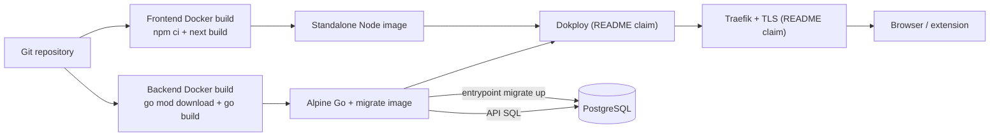

# 04 — Dependencies, Delivery, Testing, Resilience, and Operations

## 1. External services and meaningful dependencies

### Runtime services

| Dependency | Why/where | Data shared | Timeout/retry/failure | Replaceability/lock-in/cost |
|---|---|---|---|---|
| Clerk | Web authentication; Next SDK and Go JWT verification | identity/session claims; Go stores subject only | SDK-managed; no app retry policy | High auth UX/config lock-in, replaceable with significant migration; provider pricing unknown |
| PostgreSQL 15 | All durable app/token state | all product data and token hashes | startup ping; no query timeout/retry | Essential; SQL is portable-ish but triggers/JSONB/partial indexes are PostgreSQL-specific |
| LeetCode GraphQL | Problem metadata | slug; referer/user-agent | 10s in centralized client and direct handler; no retry | Replaceable source, unofficial contract/ToS risk, no direct cost evidenced |
| alfa-leetcode-api | Fallback metadata proxy | slug | 10s in centralized client; legacy handler has no explicit timeout | Nonessential fallback; third-party availability/privacy risk |
| Moonshot Kimi | Optional hint generation | title, difficulty, answer, concept, language and user ID as `safety_identifier` | config timeout (120s default), outer 3m; no retry | Optional; OpenAI-compatible-ish call reduces switching cost; usage cost unknown |
| Iris analytics | page views and Web Vitals | navigation/performance metadata | library behavior unknown | Nonessential; self-hosted-looking hardcoded endpoint, source absent |
| Dokploy/Traefik/VPS | Claimed build/deploy/reverse proxy/TLS | images, env, traffic | configuration absent | **Strong inference** from README only; actual lock-in/region/cost unknown |
| Chrome Web Store | Extension distribution | ZIP/listing and user install metadata | manual review | Manual external release dependency |

### Frontend runtime/build libraries

- Next 16 / React 19: application rendering, routing, standalone server. Essential.
- `@clerk/nextjs`: identity UI/hooks/proxy. Essential.
- TanStack Query: server-state lifecycle/cache. Valuable and consistently used.
- Axios: shared client/interceptors. Replaceable with `fetch`; browser-only usage
  means several Node-specific advisories may not apply, but the locked package
  must still be upgraded.
- Zustand: tiny review-session store. Replaceable with component/reducer state;
  justified but not essential.
- React Hook Form + resolver/Zod packages: active form uses RHF but does not use
  the resolver/Zod schema; the Zod dependency is underused.
- shadcn/Radix, Tailwind, class utilities, Lucide/Tabler, Recharts,
  react-markdown/remark: UI primitives, styling, icons, charts, safe-by-default
  Markdown.
- `iris-analytics`: used. `@bigchill101/iris`: no import found, likely obsolete.
- `@tanstack/react-form`: no import found.
- `@dnd-kit/*`: supports concept organization UI dependency path; verify actual
  imports before retaining all packages.
- Bundle analyzer: build-only, enabled via `ANALYZE`.

### Backend libraries

- Echo: HTTP router/middleware; central framework.
- pgx + sqlx: PostgreSQL driver and struct/query convenience; both are intentional.
- Clerk Go SDK: JWT verification.
- validator/v10: request validation through Echo's custom validator.
- zerolog: structured logs; standard `log` is still mixed in.
- godotenv: local `.env`; nonessential in production.
- `x/time/rate`: local extension-auth rate limit.
- golang-jwt: extension access tokens. Security-critical.
- golang-migrate binary: container/runtime deployment dependency, sourced as a
  separate pinned image rather than Go module.

### Extension dependencies

Only TypeScript, Chrome types, and rimraf are declared; runtime output uses
browser APIs and no bundled third-party runtime library. This is a positive
attack-surface choice.

### Supply-chain snapshot (2026-07-30)

`npm audit --json` against the current lockfiles reported:

- frontend: 19 vulnerable package nodes — 3 critical, 13 high, 2 moderate,
  1 low. Direct affected packages include locked `@clerk/nextjs`, `next`, and
  `axios`; a non-major Next fix was offered at 16.2.12. The Clerk route-protection
  advisory is directly relevant because `proxy.ts` is the dashboard gate.
- extension: one high `brace-expansion` transitive finding with a fix available;
  this appears build-time because the extension has no runtime npm dependencies.

This is an advisory match, not proof that every listed exploit path is reachable.
Nevertheless, framework/auth findings are release-priority because the affected
features are used. No `govulncheck` binary was installed, so Go module
vulnerability reachability was not assessed. Lockfiles make builds reproducible
at a package level; Docker base images are tag-pinned only to major/minor-like
tags and no digest/SBOM/signature policy exists.

## 2. Source-to-production path

Text explanation: each project builds independently. Backend produces a static
Go binary and copies the migrate CLI/migrations into Alpine; its entrypoint
migrates then starts. Frontend copies Next standalone output into Node Alpine.
README says Dokploy builds/deploys and Traefik terminates TLS, but no deployment
manifest proves triggers, registry, service names, domains, networks, checks,
replicas, or rollout policy.

### Confirmed build artifacts

- frontend: `.next/standalone`, `.next/static`, `public`, then container image.
- backend: `/app/server`, migrations, migrate CLI, entrypoint, then image.
- extension development: `dist/`; release: ZIP named
  `releases/algomind-extension-vX.Y.Z.zip` with localhost permission stripped.

### Migrations and rollout risk

Every backend container start executes `migrate up`. This is convenient for one
replica but couples application availability to DB migration success. A failed
migration prevents the API from starting. Concurrent replicas may all invoke the
migrator. There is no expand/contract policy, backward-compatibility check,
backup gate, maintenance window, or tested rollback. Some down migrations are
destructive by nature; application rollback after a forward-only data change is
not defined.

### Deployment facts not established

Registry, branch trigger, production region, VPS/provider/spec, DNS, TLS issuer,
reverse-proxy labels, firewall, private DB networking, managed/self-hosted DB,
volume, backups, restore point objective, health check wiring, restart policy,
resource limits, replicas, zero-downtime behavior, secrets store, promotion,
rollbacks, log destination, and CDN are all **Unknown**.

## 3. CI/CD

No `.github/workflows`, GitLab pipeline, Dokploy manifest, or other CI definition
exists. GitHub PR records show CodeRabbit comments/check summaries, but that is
not evidence that application lint/tests/builds were required for merge.

Consequences:

- no automated frontend lint/build, backend tests/vet, extension typecheck/build;
- no dependency, secret, license, container, SAST, or migration scan;
- no build artifact provenance/SBOM;
- no environment promotion or deployment record in source;
- no concurrency control for deployments;
- no rollback verification;
- no evidence of branch protection or mandatory reviews;
- no automated extension package validation.

Recommended minimum workflow:

1. On every PR: frontend `npm ci`, lint, build; backend test/vet;
   extension `npm ci`, typecheck, build; migration up/down/up on disposable
   PostgreSQL; dependency audit with an explicit policy.
2. Build images once by digest and scan them.
3. On protected main merge: deploy the exact digests to staging, smoke-test
   health plus authenticated workflows, require approval for production.
4. Separate migration job with backup/compatibility gate; app replicas must not
   all migrate.
5. Record environment, image digest, migration version, actor, time, and rollback.

These are recommendations, not current commands.

## 4. Testing map

### Current tests and checks

| Category | What exists | What it proves | Major gaps |
|---|---|---|---|
| SRS unit | `internal/srs/algo_test.go` | scheduling cases/edge rules | property tests, timezones, concurrent review |
| Config unit | `config_test.go` | defaults/env parsing/load | fatal-required behavior, overflow, URL/secret validation |
| DTO/validator unit | DTO and server validator tests | required/enums, validator wiring | all handler contracts, length/body constraints |
| Security token unit | `security/tokens_test.go` | randomness shape/hashing | extension service JWT/rotation/replay |
| Rate-limit unit | `ratelimit/store_test.go` | allow/burst behavior | eviction, multi-instance, proxy IP |
| Model unit | JSON array scanner | JSONB adapter | all SQL model mappings |
| LeetCode unit | URL normalization | common URL cases | hostile hostnames, HTTP mocking/fallback |
| Observability unit | level/error helpers | mapping | middleware integration/request IDs |
| Repository mapping | one reflect mapping test | regression fixed in `04fb2b2` | real PostgreSQL queries/transactions |
| Backend compile/static | `go test`, `go vet` | packages compile, current unit tests pass | race detector, integration/E2E |
| Frontend | build only, no test files | production compile/type collection | lint currently fails; zero behavior tests |
| Extension | typecheck/build scripts, no tests | TS types/build | auth/storage/message/capture behavior |

Verification on 2026-07-30:

- backend tests and vet passed;
- extension typecheck passed;
- frontend production build passed;
- frontend lint failed:
  - `review-card.tsx:61` synchronous setState in effect;
  - `hooks/use-mobile.ts:14` synchronous setState in effect;
  - `submitProblemForm.tsx:130` React Compiler/RHF `watch` warning.
- build warned about stale `baseline-browser-mapping` data and a metadataBase
  fallback during page generation.

### Workflow-to-test matrix

| Workflow/business rule | Test coverage |
|---|---|
| Web login/Clerk token/provisioning | none |
| Tenant isolation for every resource | none |
| Create problem + state transaction | none |
| Duplicate external problem race | none |
| LeetCode direct/fallback | URL parser only |
| Review log atomicity/streak/reset | SRS math only; service/DB none |
| Concept override/reset/cascade | none |
| Folder hierarchy/ownership | none |
| Pair, refresh rotation/replay/revoke | random primitives only |
| Capture dedupe/failure/convert repair | none |
| Metrics formulas | none |
| Docker migration/startup | none |
| Frontend query invalidation/errors | none |
| Stored HTML safety | none |

### Prioritized missing tests for safe AI-assisted change

1. **P0 tenant authorization integration suite** for every ID-based route,
   especially folder parent/assignment and concept reviews.
2. **P0 auth dependency regression/E2E**: protected route cannot be bypassed;
   API rejects malformed/expired/audience-wrong tokens; dev bypass disabled in
   production.
3. **P0 extension service tests** for one-use pairing, concurrent exchange,
   access claims, rotation, expiry, replay revocation, and user ownership.
4. **P0 HTML sanitization/browser XSS test** for LeetCode/manual descriptions.
5. **P1 problem/review PostgreSQL tests** proving transaction rollback,
   duplicate behavior, concurrent review semantics, streak dates, cascade/reset.
6. **P1 migrations up/down/up** from empty DB and upgrade fixtures including
   legacy invalid data.
7. **P1 API contract tests** for all methods/status/error shapes.
8. **P1 Playwright journeys**: sign in (test Clerk), add, review, library delete,
   concept override, inbox conversion.
9. **P2 metrics golden-data tests**, including correct problem count and timezone.
10. **P2 extension mocked-fetch/storage tests** and built-manifest permission test.
11. **P2 accessibility tests** (axe + keyboard) for auth/form/review/dialogs.
12. **P3 load tests** for queue, metrics, token refresh, capture provider latency.

Use a disposable real PostgreSQL container for repository/integrity tests; SQL
mocking would miss triggers, partial indexes, and foreign-key behavior.

## 5. Error handling and resilience

### Current strengths

- Parameterized SQL throughout inspected paths.
- Important multi-write operations use transactions with deferred rollback.
- Central HTTP error handler separates public message and internal error and adds
  request IDs.
- Echo recover middleware logs panic stacks and returns 500.
- External clients generally use contexts/timeouts and provider bodies are
  size-limited in the Kimi client.
- Extension refresh rotation/replay response is transactionally designed.
- Capture path preserves a failed inbox record when enrichment is unavailable.

### Weaknesses and practical consequences

| Weakness | Evidence | Consequence |
|---|---|---|
| no graceful shutdown | `main.go`, `Server.Start` only | dropped in-flight requests/jobs during deploy |
| non-durable goroutine | `problems/service.go → enqueueHintGeneration` | lost hints, no retry/status |
| swallowed reset error | `reviews/service.go:89–95` | inconsistent concept schedule, no diagnostic |
| no DB/query timeout | raw request context, pool defaults | slow DB can pin handlers/connections |
| legacy `http.Get` no timeout | `handlers/fetch_leetcode.go` | request can hang until transport-level behavior |
| inconsistent errors | auth direct JSON vs central handler | client cannot reliably parse/correlate |
| no idempotency/concurrency control | review/manual create routes | duplicates/lost updates |
| no general rate/body limit | server middleware | abuse/resource exhaustion risk |
| in-process rate limit | handler/store | reset/multiply across instances; memory growth |
| migration on app startup | `entrypoint.sh` | failed or incompatible migration blocks deployment |
| no provider retry/circuit breaker | LeetCode/Kimi | transient errors become user errors/lost work |
| destructive history cascades | migration triggers/FKs | support/audit evidence disappears on deletes |

No cache, queue, background-job watchdog, dead-letter store, fallback service,
circuit breaker, bulkhead, or duplicate request key exists.

## 6. Observability

### Present

- Echo request IDs.
- Structured zerolog request events: method, URI/route, IP, host, user agent,
  request/response sizes, status, latency, request/user ID.
- Structured panic and central error logs.
- Structured Kimi lifecycle logs with job/user/problem IDs, duration, provider,
  response sizes/previews on error.
- Some handlers add component/handler context.
- `/health` liveness response.
- Iris pageviews/Web Vitals on the web client.

### Absent or unreliable

- no metrics endpoint (Prometheus was added then reverted in commits `2bf7004`
  and `74e6a0e`);
- no distributed traces/spans;
- no log sink/retention/query documentation;
- no error tracker;
- no dashboards, SLOs, alerts, on-call, audit log;
- no readiness check or DB/provider health;
- no build/version/commit field in health/logs;
- mixed standard and JSON log formats;
- no request ID returned by auth middleware;
- no job table to inspect hint work;
- no DB slow-query/connection metrics in app;
- no extension telemetry/support diagnostics.

Therefore it is currently impossible from repository evidence to reliably answer
historical questions such as “how many hint jobs were permanently lost,” “which
deployment introduced latency,” “is the DB pool saturated,” or “which user
changed a concept before deletion.”

## 7. Production debugging playbooks

### Users cannot log in

1. Separate page access from API access: can `/sign-in` render? does Clerk form
   return an error? does `/dashboard` redirect?
2. Browser network: inspect Clerk requests and active session; never copy tokens
   into tickets.
3. Confirm frontend build-time Clerk publishable key and configured domains in
   Clerk (dashboard step; exact UI unknown).
4. If dashboard loads but data 401s, inspect Axios Authorization header presence
   and API logs by request ID.
5. Check backend `CLERK_SECRET_KEY`, clock, SDK errors, and recent secret rotation.
6. Check whether current Clerk/Next advisory remediation/version is deployed.

### API returns errors

1. Capture method/path/status and response `request_id`.
2. Query structured logs for request ID; correlate handler/internal DB/provider
   errors.
3. `GET /health` only proves process responsiveness.
4. Test DB connectivity/migration version with approved operator access.
5. Reproduce the exact authenticated request in staging; distinguish validation,
   ownership, database, and external provider failures.

### Slow requests

1. Use request log `duration_ms` by route/status.
2. Separate frontend hydration/client fetch from server latency in browser timing.
3. Compare metrics route vs provider routes; Kimi is background and should not
   delay create after commit, while LeetCode capture/fetch is synchronous.
4. Inspect PostgreSQL activity/locks/query plans and connection counts—commands
   depend on provider and are not in repo.
5. Check API CPU/memory/network and proxy timing in Dokploy/Traefik.
6. Add temporary bounded diagnostics; do not log answers/tokens.

### Database unavailable or data incorrect

1. DB unavailable: inspect startup `Could not connect`, migration output, network,
   credentials, TLS, max connections, and provider status.
2. Data incorrect: identify user/entity IDs and compare owning rows, current
   state, logs, and migration version in a read-only transaction.
3. For schedule errors, recompute from the prior review state is difficult because
   logs do not store before/after interval/ease. State that limitation.
4. Never make production corrections until a backup and exact audited SQL are
   prepared; no repository correction tool exists.

### Deployment failed

1. Classify frontend build, backend build, image pull, migration, bind, health,
   proxy, or env failure.
2. For backend startup, migration output comes before server logs.
3. Record current/previous image digest and DB migration version; repo does not
   define how to obtain them.
4. Do not blindly run down migrations. Prefer restoring the last compatible app
   if schema is backward compatible; otherwise use the reviewed migration plan.

### External provider or background job failure

- LeetCode: direct metadata endpoint falls back in the web hook; capture client
  also falls back. Failed captures display retry. Manual entry is the product
  fallback.
- Kimi: search `component=llm_hint_generation`, `job_id`, `problem_id`. A blank
  hint plus queued response can mean failure/loss; there is no retry endpoint.
- Iris: verify browser console/network and endpoint; product behavior should be
  decoupled but has no test.
- “Stuck background job” cannot be enumerated because jobs are not stored. A
  running goroutine is not externally inspectable through app APIs.

### Frontend local works, production fails / missing configuration

1. Compare **build-time** public values, not just runtime container env.
2. Confirm `NEXT_PUBLIC_API_URL` is HTTPS and includes `/api/v1`.
3. Check CORS exact origin; only `https://algomind.pro` is allowed.
4. Inspect mixed-content, DNS/TLS, and proxy routing.
5. Rebuild after changing `NEXT_PUBLIC_*`.
6. Backend missing Clerk/DB fails fast; optional Kimi silently disables hints;
   invalid numeric settings silently default.

